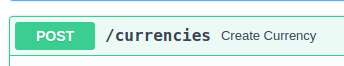

##### Desafio-Tecnico_GiroTech #####

- In order for the code to work perfectly, you will need to import “fastapi”. You can do this from the Visual Studio Code terminal itself, using “pip istall fastapi uvicorn”. 
- In order to run this code, you need to run the following command from the VsCode (Visual Studio Code) terminal: uvicorn challenge:app --reload. This will give you a link that you must paste into your browser using “/docs” at the end of the link. From there you can implement the data. By opening the “POST” tab, for example, you can add data that will appear in your link. The link will always correspond to the writing next to the name of the tab you opened. Example:  next to it we can see “/currencies”, which added to the end of the link, also “/docs”, will bring up the data in a cleaner and more readable way.

# Explanation of functionality

- The code provides an API for managing data, allowing us to test inserting, retrieving, updating, and deleting records in a database. It enables seamless interaction with the database through structured API requests, ensuring efficient data manipulation and testing.

# Code explanation
- Import:
    - FastAPI - Creates and manages the API.
    - Pydantic - Defines the data models, ensuring validation.
    - List - Used to store the list.

- Class:
    -  We have created a class for each type, which defines the required fields. This class performs automatic validation. If the client sends something different, FastAPI rejects the request.

- Database simulation:
    - We created a list to store the data (simulating a database).
    - We created a counter to generate IDs automatically.

- POST endpoints:
    - POST-type endpoints are used to create new resources on the server. Whenever we need to add a new record to the database we use POST.

- PUT endpoints:
    - Endpoints of type PUT are used to update an existing resource on the server. If we have a record already saved in the database and we want to modify it, we use PUT. Unlike POST, which creates new records, PUT completely replaces the data of an existing resource.

- DELETE endpoints:
    -DELETE endpoints are used to remove a resource from the server. When we no longer need a record, we use DELETE to delete it. After removal, the server can return a success message or the deleted item itself.

- GET endpoints:
    - GET endpoints are used to fetch information from the server. Unlike POST, PUT and DELETE, GET doesn't modify the data in the database, it just queries it and returns it.